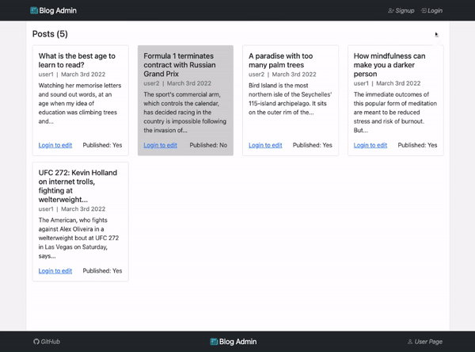

# Blog API Client Admin
> A React front-end for admin for a blog web application built using the MERN stack. Live demo [here](https://yamakenth.github.io/blog-api-client-admin/).
## General Information
- This is one of two front-end apps served by a back-end
  - Visit the client(user) front-end repository of this project [here](https://github.com/yamakenth/blog-api-client)
  - Vist the back-end repository of this project [here](https://github.com/yamakenth/blog-api-server)
- Test account credentials:
  - username: **user1**
  - password: **user1**
## Screen Capture

## Features
- Displays both published and unpublished blog posts on the homepage
- Enables user signup and login (JWT authentication)
- Allows logged-in users to create, read, edit, and delete blog posts and read and delete comments
## Technologies Used
- HTML
- CSS
- Bootstrap
- JavaScript
- React.js